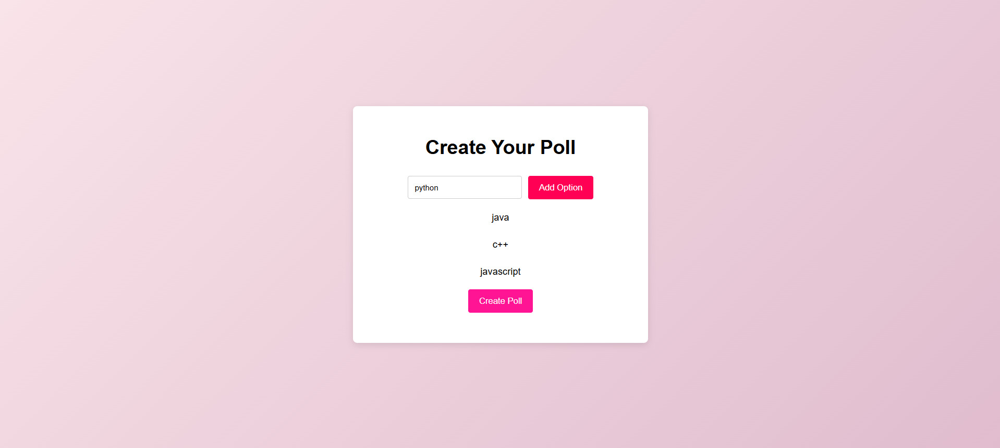
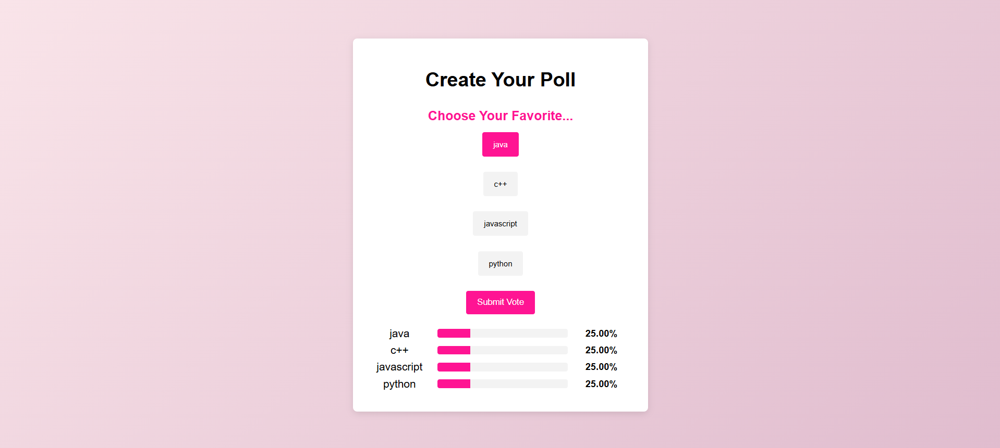

# Choose Your Fav - Poll System Creator

## Description
"Choose Your Fav" is a simple yet interactive poll system creator designed to help users easily create and manage polls. It provides a visually appealing interface where users can create polls, add options, and view the results in a clean and user-friendly format.

### Features:
- **Interactive Poll Creation**: Allows users to create polls with customizable options.
- **Real-Time Results**: View real-time results as users vote.
- **Responsive Design**: Optimized for desktop and mobile views.
- **Simple & Elegant UI**: A clean, intuitive interface for a smooth user experience.

### How It Works:
1. Users enter the poll question and options.
2. Poll options are displayed to the participants.
3. Users vote for their favorite option.
4. The results are displayed in real-time, showing the percentage of votes for each option.

## Screenshots
### Poll Creation

### Poll Results

### Benefits:
- **Ease of Use**: User-friendly design ensures anyone can create and manage polls effortlessly.
- **Real-Time Feedback**: Get instant insights on poll results, helping in decision-making.
- **Mobile-Friendly**: Accessible from various devices, ensuring a seamless experience.
- **Customization**: Poll options and results can be styled according to personal preferences.

### Future Scope:
- **Enhancements**: Additional features like analytics, exporting results, or integrating social sharing.
- **User Feedback**: Incorporate feedback from users to improve functionality and design.
- **Expandable**: Building integrations with external APIs for advanced functionalities.

### Contribution:
Contributions to improve the project are welcome! Please follow these steps to contribute:
1. Fork this repository.
2. Make your changes.
3. Submit a pull request.
4. Your contribution will be reviewed and merged accordingly.

---  
Feel free to add changes, enhancements, or new features to improve the project.
